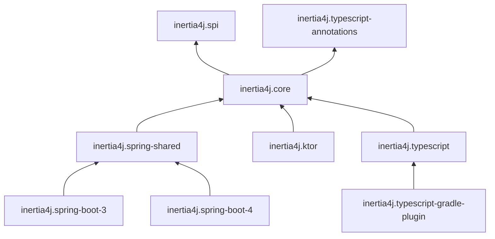
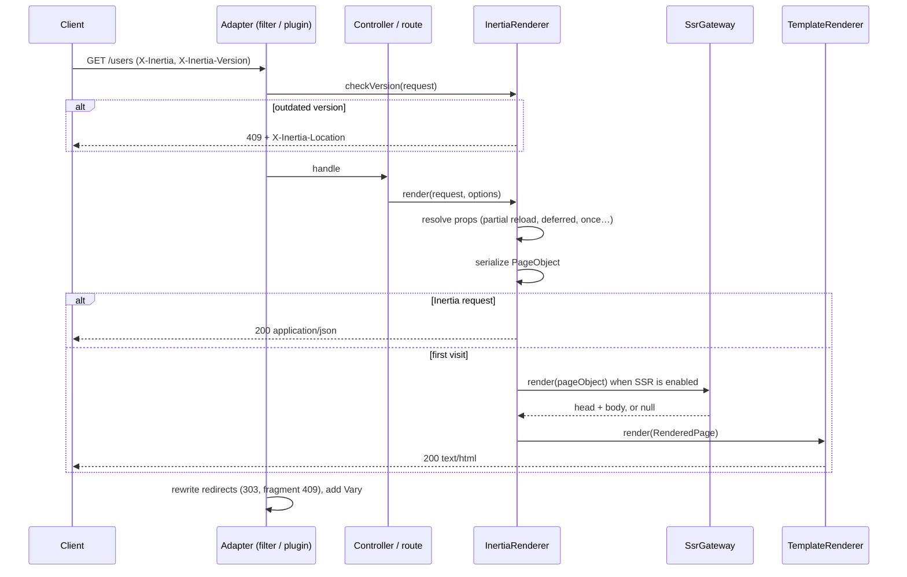

# Architecture

This page is for contributors and for anyone writing an adapter for another framework. It maps the
[core concepts](core-concepts.md) to modules and classes.

## Modules

| Module                               | Java | Responsibility                                                                                       |
|--------------------------------------|------|------------------------------------------------------------------------------------------------------|
| `inertia4j.spi`                      | 11   | Interfaces users implement: `PageObjectSerializer`, `TemplateRenderer`, `SsrGateway`, `JsonReader`, and the `PageObject` model |
| `inertia4j.typescript-annotations`   | 11   | `@InertiaPage`, `@InertiaShared`, `@InertiaForm`, `@TypeScriptName`                                  |
| `inertia4j.core`                     | 11   | The protocol: rendering, props resolution, redirects, versioning, Vite, SSR client, test assertions  |
| `inertia4j.spring-shared`            | 17   | Spring MVC integration shared by both Boot versions: `AbstractInertia`, filters, properties, MockMvc matchers |
| `inertia4j.spring-boot-3` / `-4`     | 17   | Auto-configuration and the `Inertia` bean for each Boot generation (Jackson 2 vs 3, Actuator APIs)   |
| `inertia4j.ktor`                     | 11   | Ktor plugin, `inertia` routing extension, session flash store, `testApplication` assertions          |
| `inertia4j.typescript`               | 17   | Scans compiled classes and writes the `.d.ts` file                                                   |
| `inertia4j.typescript-gradle-plugin` | 17   | `generateInertiaTypes` and `checkInertiaTypes` tasks                                                 |

Rules that keep this graph healthy:

- `core` never depends on a web framework. Jackson is a `compileOnly` dependency, detected at runtime.
- Adapters stay thin: they translate framework requests into `HttpRequest`, call `InertiaRenderer` and translate the
  `HttpResponse` back. Protocol behavior belongs in `core` so every adapter gets it.
- Changing an interface in `spi` breaks user code. Add default methods rather than new abstract ones.

## Request lifecycle

Key classes in `dev.arkoder.inertia4j.core`:

| Class                     | Role                                                                                         |
|---------------------------|----------------------------------------------------------------------------------------------|
| `InertiaRenderer`         | Entry point: `render`, `redirect`, `location`, `checkVersion`. Built with `InertiaRenderer.builder(...)` |
| `InertiaRenderingOptions` | Per-response input: component, props, shared props, flags, status, flash data, errors         |
| `PropsResolver`           | Filters props for partial reloads and resolves lazy values and `InertiaProp` wrappers        |
| `InertiaProp` / `InertiaProps` | Prop types and their modifiers                                                          |
| `InertiaRedirects`        | Status and header rules for redirects, used by adapters' middleware                          |
| `InertiaHeaders`          | Protocol header names and request predicates                                                 |
| `HttpRequest` / `HttpResponse` | Framework-neutral request and response                                                  |
| `SimpleTemplateRenderer`  | Default `TemplateRenderer`, placeholder substitution                                         |
| `HttpSsrGateway`, `SsrServerProcess` | SSR client and managed Node.js process                                            |
| `vite.Vite`               | Dev server detection, manifest reading, tag rendering, asset version                         |
| `testing.AssertableInertia` | Assertions shared by the Spring and Ktor test helpers                                      |

## Adding a feature

1. Implement the protocol behavior in `core`, with unit tests against `InertiaRenderer` using a fake `HttpRequest`.
2. Expose it in each adapter: the Spring `AbstractInertia` (and `Inertia.Options` for response flags) and the Ktor
   `InertiaKtorRenderer.Renderer`. Keep method names identical across adapters.
3. Add adapter tests: MockMvc in `spring-boot-3`/`-4`, `testApplication` in `ktor`.
4. If the feature adds page object metadata, extend `AssertableInertia` so users can assert it.
5. Document it in the matching [guide](README.md#guides), with both a Java and a Kotlin example.

## Writing an adapter for another framework

An adapter needs to:

1. Implement `HttpRequest` for the framework's request type (`getUrl()` returns path and query string,
   `getFullUrl()` the absolute URL).
2. Build an `InertiaRenderer` once, with a serializer, a template renderer and a version supplier.
3. Before each request, call `InertiaRenderer.checkVersion(request)` and return its response when present.
4. In handlers, build `InertiaRenderingOptions` and call `render`; copy status, headers and body to the framework
   response.
5. After each request, pass redirect statuses and locations through `InertiaRedirects`, and add `Vary: X-Inertia`.
6. Store flash data, errors and redirect flags in the framework's session between requests.

The Ktor module is the smallest complete example to read.

## Build

The build uses Gradle with convention plugins in `build-logic`:

- `inertia4j.java-conventions`: Java 11 toolchain, sources and Javadoc jars, JUnit Platform.
- `inertia4j.publishing-conventions`: Maven publication to GitHub Packages with shared POM metadata
  (`Inertia4jPublishing.kt`).
- `inertia4j.spring-conventions`: Java 17, Spring dependency management, `-parameters`.

Dependency versions live in `gradle/libs.versions.toml`, the project version in `gradle.properties`. See [CONTRIBUTING.md](../CONTRIBUTING.md) for the development workflow.
